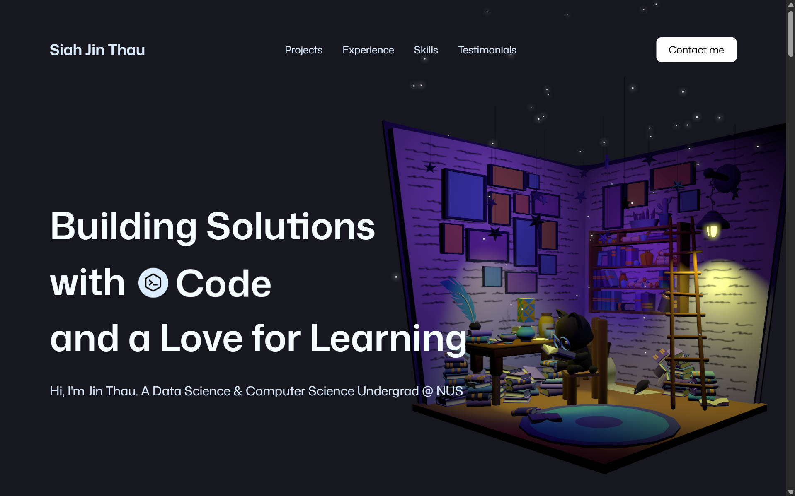

# 🚀 Jin Thau's Portfolio Website

[](https://jinthau.com)
[](https://cloud.google.com)
[](https://reactjs.org)
[](https://threejs.org)

> **A modern, interactive portfolio website showcasing my journey in Data Science and Compputer Science**

🌐 **Live Website:** [jinthau.com](https://jinthau.com)



## ✨ Features

### 🎮 Interactive 3D Experience
- **Immersive 3D Library Scene** - Interactive 3D model with dynamic lighting and particle effects
- **Responsive Camera Controls** - Smooth orbit controls optimized for both desktop and mobile
- **Real-time Lighting System** - Multiple colored spotlights with dynamic shadows

### 🎨 Modern UI/UX Design
- **Glassmorphism Effects** - Beautiful translucent design elements
- **Smooth Animations** - GSAP-powered transitions and scroll-triggered animations
- **Responsive Layout** - Seamless experience across all devices
- **Interactive Hover Effects** - Engaging micro-interactions throughout

### 🔧 Smart Functionality
- **Project Showcase** - Interactive modals with detailed project information
- **Skills Matrix** - Categorized technical skills with visual representations
- **Experience Timeline** - Dynamic timeline with company-themed styling
- **Contact Integration** - EmailJS-powered contact form with real-time validation
- **Dark Theme** - Carefully crafted dark mode design

### 📱 Performance Optimized
- **Lazy Loading** - Optimized asset loading for faster page speeds
- **Mobile-First Design** - Touch-optimized interactions for mobile devices
- **SEO Friendly** - Proper meta tags and semantic HTML structure
- **Accessibility** - WCAG compliant with keyboard navigation support

## 🛠️ Tech Stack

### Frontend Framework
- **React 18** - Modern React with hooks and context
- **Vite** - Lightning-fast build tool and dev server
- **React Router** - Client-side routing with lazy loading

### 3D Graphics & Animation
- **Three.js** - WebGL-based 3D graphics library
- **React Three Fiber** - React renderer for Three.js
- **React Three Drei** - Useful helpers for R3F
- **GSAP** - Professional animation library with ScrollTrigger

### Styling & Design
- **Tailwind CSS** - Utility-first CSS framework
- **Custom CSS** - Advanced animations and glassmorphism effects
- **Responsive Design** - Mobile-first approach with breakpoint optimization

### Development Tools
- **JavaScript ES6+** - Modern JavaScript features
- **EmailJS** - Email service integration for contact form
- **React Responsive** - Media query hooks for React

### Hosting & Deployment
- **Google Cloud Platform** - Scalable cloud hosting
- **Custom Domain** - Professional domain setup at jinthau.com

## 📂 Project Structure

```
src/
├── components/           # Reusable React components
│   ├── HeroExperience.jsx       # 3D scene manager
│   ├── Modal.jsx                # Reusable modal component
│   ├── GlowCard.jsx             # Interactive glow effects
│   └── ...
├── sections/             # Main page sections
│   ├── Hero.jsx                 # Landing section with 3D scene
│   ├── ShowcaseSection.jsx      # Project portfolio
│   ├── Contact.jsx              # Contact form
│   └── ...
├── constants/            # Data and configuration
│   ├── projects.js              # Project information
│   ├── experiences.js           # Work experience data
│   ├── skills.js                # Technical skills data
│   └── ...
├── pages/                # Route components
│   ├── HomePage.jsx             # Main portfolio page
│   └── AttributionsPage.jsx     # Credits and attributions
└── index.css             # Global styles and animations
```

## 🚀 Getting Started

### Prerequisites
- Node.js 16+ 
- npm or yarn package manager

### Installation

1. **Clone the repository**
   ```bash
   git clone https://github.com/AsJayTee/portfolio-website.git
   cd portfolio-website
   ```

2. **Install dependencies**
   ```bash
   npm install
   # or
   yarn install
   ```

3. **Environment Setup**
   Create a `.env` file in the root directory:
   ```env
   VITE_EMAILJS_SERVICE_ID=your_service_id
   VITE_EMAILJS_TEMPLATE_ID=your_template_id
   VITE_EMAILJS_PUBLIC_KEY=your_public_key
   ```

4. **Start the development server**
   ```bash
   npm run dev
   # or
   yarn dev
   ```

5. **Open your browser**
   Navigate to `http://localhost:5173`

### Build for Production

```bash
npm run build
# or
yarn build
```

## 🌐 Deployment

This website is deployed on **Google Cloud Platform** with the following setup:

- **Domain:** [jinthau.com](https://jinthau.com)
- **Hosting:** Google Cloud Storage + Cloud CDN
- **SSL Certificate:** Google-managed SSL certificate
- **DNS:** Cloud DNS for domain management

### Deployment Steps (GCP)
1. Build the production version
2. Upload static files to Cloud Storage bucket
3. Configure Cloud CDN for global distribution
4. Set up domain mapping and SSL certificate

## 🎯 Key Highlights

### Technical Achievements
- **3D Integration** - Seamless integration of Three.js with React
- **Performance Optimization** - Lazy loading and code splitting
- **Mobile Responsiveness** - Touch-optimized interactions
- **Animation System** - Complex scroll-triggered animations
- **Modular Architecture** - Reusable component design

### Design Philosophy
- **User Experience First** - Intuitive navigation and interactions
- **Visual Hierarchy** - Clear information architecture
- **Brand Consistency** - Cohesive color scheme and typography
- **Accessibility** - Inclusive design principles

## 📊 Performance Metrics

- **Lighthouse Score:** 95+ (Performance, Accessibility, Best Practices)
- **First Contentful Paint:** < 1.5s
- **Largest Contentful Paint:** < 2.5s
- **Cumulative Layout Shift:** < 0.1
- **Mobile Optimization:** Touch-friendly with optimized assets

## 🤝 Contributing

While this is a personal portfolio, I welcome feedback and suggestions! Feel free to:

1. **Report Issues** - Found a bug? Please open an issue
2. **Suggest Features** - Have an idea for improvement? Let me know
3. **Share Feedback** - General thoughts and recommendations are appreciated

## 📜 License & Credits

### Open Source Libraries
- **React** - MIT License
- **Three.js** - MIT License  
- **GSAP** - Commercial License
- **Tailwind CSS** - MIT License

### Assets & Attributions
- **3D Model:** "Unlucky Library" by Bee Badea (CC-BY-4.0)
- **Icons:** Flaticon (Various creators - see [Attributions](https://jinthau.com/attributions))
- **Fonts:** Mona Sans by GitHub

For a complete list of attributions, visit: [jinthau.com/attributions](https://jinthau.com/attributions)

---

<div align="center">

**Built with ❤️ using React, Three.js, and modern web technologies**

⭐ **Star this repo if you found it interesting!** ⭐

</div>